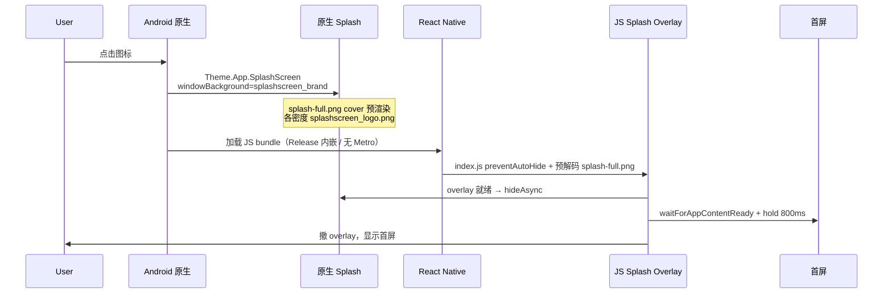

# 记得 App 冷启动与 Splash 优化指南

日期：2026-08-07  
状态：已在 Honor 真机（Android 12+）与 Windows 构建链验证  
适用：`记得` / `remember-app` / `com.remember.app`  
关联：[Android Release 构建（Windows）](./android-release-build-windows.md)

---

## 1. 文档目的

记录 2026-08 冷启动与启动页（splash）优化的**完整链路**、**踩坑与规避**、**最终实现**，以及 **Release APK** 与 **Standalone Debug APK** 的分工。  
后续重构移动端入口、Expo 插件、构建脚本或 splash 资源时，**先读本文**，避免破坏已验证的启动体验。

---

## 2. 启动链路全景

### 2.1 时间线（Release / Standalone Debug，真机冷启动）

| 阶段 | 约耗时 | 用户看到什么 | 负责层 |
|------|--------|--------------|--------|
| T0 | 0 ms | 系统拉起 `MainActivity` | Android |
| T1 | 0–200 ms | 灰底 `#F5F6FA` + 居中 ∞ logo（与 JS overlay 同图） | **原生 splash**（`windowBackground` + 预渲染 PNG） |
| T2 | ~200 ms–1 s | 同上（原生仍被 `preventAutoHide` 持有） | 原生 + RN 初始化 |
| T3 | JS bundle 就绪后 | JS overlay 解码 `splash-full.png`，`hideAsync` 撤原生层 | **JS overlay**（`_layout.tsx`） |
| T4 | 首屏 `onLayout` + 800 ms hold | 仍显示 overlay | `useAppSplashScreen` |
| T5 | overlay 撤掉 | 首页（今日 / 书库） | 业务首屏 |

adb 实测（Release，`remember-splash-brand.apk`）：`TotalTime` 约 **1.6 s**；200 ms 截图已与 JS overlay 视觉一致。

### 2.2 架构示意



### 2.3 三层分工（不要混用职责）

| 层 | 作用 | 关键约束 |
|----|------|----------|
| **原生 splash** | 在 JS 未就绪前展示品牌画面 | 必须与 JS 使用**同一素材、同一 cover 算法**；不能用 Android 12 `animatedIcon` 塞整帧图 |
| **JS overlay** | 原生 hide 与首屏绘制之间的无缝过渡 | 必须等 `onLoadEnd` 再 `hideAsync` |
| **首屏 hold** | 避免 overlay 一闪而过 | `SPLASH_MIN_HOLD_AFTER_CONTENT_MS = 800`；改小需产品确认 |

---

## 3. Release APK 与 Debug 包的区别

本项目有**三种**容易混淆的 Android 产物：

| 类型 | 构建方式 | JS 来源 | Metro | `__DEV__` | 典型用途 |
|------|----------|---------|-------|-----------|----------|
| **Expo 开发包** | `pnpm --filter @remember/mobile start` + 本机 `expo run:android` | Metro 实时加载 | ✅ 必须 | `true` | 日常改代码、热更新 |
| **Standalone Debug APK** | `tools/mobile/build-standalone-debug-apk.ps1` | **内嵌** bundle（`export:embed`，`--dev false`） | ❌ 禁用 | `false` | 真机联调 API、验收启动，**不依赖电脑** |
| **Release APK** | `tools/mobile/build-standalone-release-apk.ps1` | 内嵌 bundle | ❌ 无 | `false` | 内测分发、RC、商店；**release 签名** |

### 3.1 为什么需要 Standalone Debug APK

- 普通 **debug 变体**默认 `debuggableVariants` 含 `debug` → **不打包 JS**，启动会连 Metro（8081）；电脑不在线则白屏/连机页。
- **Standalone Debug** 通过插件 `with-android-bundle-in-debug.js`：
  - `debuggableVariants = []` → debug 也 embed bundle；
  - `MainApplication` 里 `useDevSupport = false` → 不启 DevSupport。
- 仍保留 `android:debuggable=true`，可用 `adb run-as` 查 SQLite（Release 不可用）。

### 3.2 为什么 Release 与 Standalone Debug 启动表现应一致

两者都走**内嵌 bundle + 无 Metro**，splash 与懒加载逻辑相同。  
差异主要在：签名、混淆（若开启）、体积、是否 `debuggable`。**启动体验验收以 Release 为准**，Debug 仅作开发辅助。

### 3.3 构建命令速查

```powershell
# Release（需 REMEMBER_ANDROID_SIGNING_PROPERTIES）
powershell -File tools/mobile/build-standalone-release-apk.ps1 `
  -OutputApk dist/remember-standalone-release.apk

# Standalone Debug（可选 -SkipApiHealthCheck）
powershell -File tools/mobile/build-standalone-debug-apk.ps1 `
  -OutputApk dist/remember-standalone-debug.apk

# 冷启动对比（安装 → force-stop → am start -W）
powershell -File tools/mobile/benchmark-cold-start.ps1 `
  -ApkPaths dist/baseline.apk, dist/candidate.apk
```

默认构建镜像目录：`D:\r\b`（短路径，见 [android-release-build-windows.md](./android-release-build-windows.md)）。

---

## 4. 标准构建流程（含 splash patch）

Standalone 脚本统一流程：

1. `robocopy` 源码 → `BuildRoot`（**排除** `node_modules`、`apps/mobile/android`、`.expo`）
2. `pnpm install` + `pnpm build:packages`
3. **删除** `BuildRoot/apps/mobile/android`（robocopy 不会删旧目录，必须手动删）
4. `expo prebuild --platform android --clean`
5. **`node tools/mobile/patch-android-native-splash.cjs <androidDir>`**（必做，见第 5 节）
6. Debug 额外：修复 `colors.xml` 的 `<root>` 包裹（expo prebuild 偶发）
7. Release 额外：限制 `arm64-v8a`、校验签名与 `usesCleartextTraffic`
8. `gradlew assembleRelease` / `assembleDebug`

**Gradle 锁文件：** 若 `Remove-Item android` 失败，先 `gradlew --stop`，等待数秒再删。

**Patch 脚本必须是 `.cjs`：** 仓库根 `package.json` 为 `"type": "module"`，`.js` 会被当作 ESM，`require` 会报错且**静默继续构建**（曾导致 patch 未生效）。

---

## 5. 最终实现说明

### 5.1 素材（无需额外文件）

| 资源 | 路径 | 说明 |
|------|------|------|
| 全屏 splash 图 | `apps/mobile/assets/images/splash-full.png` | JS overlay 与原生预渲染**唯一源图** |
| 背景色 | `#F5F6FA` | `app.json` splash、`colors.background`、原生 `splashscreen_background` 必须一致 |

### 5.2 原生层（Android）

**预渲染（各密度 PNG）**

- 插件 / patch 调用 `generateFullScreenSplashImages()`：
  - 源图：`splash-full.png`
  - 算法：`@expo/image-utils` + `resizeMode: 'cover'`
  - 基准尺寸：360×800 × 密度倍数
  - 输出：`res/drawable-{mdpi,hdpi,...}/splashscreen_logo.png`

**Drawable / Style（patch 写入）**

```xml
<!-- drawable/splashscreen_brand.xml -->
<layer-list>
  <item>
    <bitmap android:gravity="fill" android:src="@drawable/splashscreen_logo" />
  </item>
</layer-list>
```

```xml
<!-- values/styles.xml · Theme.App.SplashScreen -->
<style name="Theme.App.SplashScreen" parent="Theme.SplashScreen">
  <item name="android:windowBackground">@drawable/splashscreen_brand</item>
  <item name="windowSplashScreenBackground">@color/splashscreen_background</item>
  <item name="windowSplashScreenAnimatedIcon">@drawable/splashscreen_empty_icon</item>
  <item name="postSplashScreenTheme">@style/AppTheme</item>
  <item name="android:windowSplashScreenBehavior">default</item>
</style>
```

要点：

- **`windowBackground`**：全屏品牌图（与 JS cover 一致）
- **`windowSplashScreenAnimatedIcon`**：透明 1dp 占位（避免默认绿色机器人）
- **父主题必须是 `Theme.SplashScreen`**：否则 `SplashScreenManager.registerOnActivity` 会 `InflateException` 崩溃
- **`ic_launcher_background.xml`**：去掉对 `@drawable/splashscreen_logo` 的引用，避免缺失资源时 fallback 到 Expo 默认机器人

### 5.3 JS 层

| 文件 | 职责 |
|------|------|
| `apps/mobile/index.js` | 最先 `preventAutoHideAsync()`；`Asset.downloadAsync(splash-full.png)` 预解码 |
| `apps/mobile/app/_layout.tsx` | 全屏 `Image` overlay，`resizeMode="cover"`，底色 `#F5F6FA` |
| `apps/mobile/src/hooks/use-app-splash-screen.ts` | overlay 就绪 → `hideAsync` → 首屏 layout → hold → 撤 overlay |
| `apps/mobile/src/shell/splash-overlay-ready.ts` | overlay 图片 `onLoadEnd` / 超时 5s |
| `apps/mobile/src/shell/app-content-ready.ts` | `ScreenScaffold` 首次 `onLayout` |
| `apps/mobile/src/components/shell/screen-scaffold.tsx` | 调用 `markAppContentReady()` |

### 5.4 Expo Config Plugins（`app.json` 顺序敏感）

| 插件 | 作用 |
|------|------|
| `expo-splash-screen` | 生成基础 splash 主题与资源 |
| `with-android-splash-brand.js` | prebuild 时生成 cover PNG + 写 drawable（可能被后续步骤覆盖，**不能替代 patch**） |
| `with-android-bundle-in-debug.js` | Standalone Debug：内嵌 bundle + 关 Metro |
| `with-android-release-signing.js` | Release 签名 |
| `with-android-cleartext-release.js` | Release 允许 HTTP（开发 API） |

**post-prebuild 的 `patch-android-native-splash.cjs` 是最终真相来源**——prebuild 插件输出与 expo 默认样式可能被覆盖或不完整（例如缺 PNG）。

---

## 6. 踩坑记录与规避

### 6.1 绿色机器人（Expo 默认 splash）

| 现象 | 原因 | 规避 |
|------|------|------|
| 白底 + 青绿圆格 + 机器人头 | `@drawable/splashscreen_logo` **资源缺失**，或 `ic_launcher_background` 仍引用默认图 | patch 必须 **生成 PNG** + 清理 launcher background；构建后检查 `drawable-xxhdpi/splashscreen_logo.png` 存在 |
| 与 Metro 无关 | Release/Standalone Debug 不连 8081 | 不要用「关 Metro」单独解释机器人；查**原生资源** |

### 6.2 黑底 + 窄白条 + ∞（错误 animatedIcon）

| 现象 | 原因 | 规避 |
|------|------|------|
| 整帧竖图被塞进 `windowSplashScreenAnimatedIcon` | Android 12 把 animated icon 当**圆形/固定槽位**缩放 | **禁止**用整帧 `splashscreen_logo` 作 animatedIcon；用 `splashscreen_empty_icon` + `windowBackground` 全屏 |

### 6.3 启动即闪退

| 现象 | 原因 | 规避 |
|------|------|------|
| `InflateException: splash_screen_view` | 把 `Theme.App.SplashScreen` 父主题改成 `Theme.AppCompat` | **必须**保持 `parent="Theme.SplashScreen"` |

### 6.4 纯灰底、无 logo（native 段）

| 现象 | 原因 | 规避 |
|------|------|------|
| JS 起来前只有 `#F5F6FA` | 仅改 color、未生成 PNG 或未设 `windowBackground=splashscreen_brand` | 跑 patch；验证 `styles.xml` 与 PNG |

### 6.5 Patch 未执行

| 现象 | 原因 | 规避 |
|------|------|------|
| 构建日志无 `Patched native Android splash resources` | patch 用 `.js` 在 ESM 下崩溃；脚本未检查 `$LASTEXITCODE` | 使用 **`patch-android-native-splash.cjs`**；构建脚本 `throw` on failure |

### 6.6 Standalone Debug 仍连 Metro

| 现象 | 原因 | 规避 |
|------|------|------|
| 8081 / 连机页 | 未用 standalone 脚本；或 `with-android-bundle-in-debug` 被移除 | 只用 `build-standalone-debug-apk.ps1`；确认 `useDevSupport = false` |

### 6.7 adb 安装 / 截图

| 现象 | 原因 | 规避 |
|------|------|------|
| `INSTALL_FAILED_ABORTED: User rejected permissions` | 手机未点「允许安装」 | 安装时在设备上确认 |
| 截图一直是桌面 | `am start` 后等待过短；或安装完成页未关 | `force-stop` → 等 2s → `am start` → 再等 200–500ms → `screencap` |
| `am start -W` 用于早帧截图 | `-W` 会等到 Activity 完全就绪，抓不到 splash | 早帧用**非 -W** 的 `am start` + `sleep` |

### 6.8 性能相关（同次优化一并记录）

| 优化 | 文件/说明 |
|------|-----------|
| 书库懒加载 | 避免启动同步拉整库 |
| Review pool SQL 批量化 | 减少首屏前 DB 压力 |
| Release 仅 arm64 | 缩短构建，略减安装体积 |

---

## 7. 验收清单

### 7.1 构建产物检查（CI / 本地）

```powershell
# 1. patch 是否成功（构建日志）
# 2. APK 内是否有 splash PNG（解压或检查构建树）
dir D:\r\b\apps\mobile\android\app\src\main\res\drawable-xxhdpi\splashscreen_logo.png

# 3. styles 是否正确
Select-String -Path D:\r\b\apps\mobile\android\app\src\main\res\values\styles.xml `
  -Pattern "splashscreen_brand|splashscreen_empty_icon|Theme.SplashScreen"
```

### 7.2 真机冷启动

```powershell
adb install -r dist/remember-splash-brand.apk
adb shell am force-stop com.remember.app
adb shell am start -n com.remember.app/.MainActivity
# 200ms / 500ms 截图：灰底 + ∞，无机器人、无黑底窄条
powershell -File tools/mobile/benchmark-cold-start.ps1 -ApkPaths dist/your.apk
```

### 7.3 通过标准

- [ ] 0–500 ms **无**绿色机器人、**无**黑底窄白条
- [ ] 原生段与 JS overlay **视觉一致**（同图同底色）
- [ ] 无白屏闪（`AppTheme.windowBackground` 为 `#F5F6FA`）
- [ ] 约 1.5–2.5 s 进入可交互首屏（视设备而定）
- [ ] Release 不依赖 Metro；Standalone Debug 同样

---

## 8. 重构防护：如何避免破坏启动链路

### 8.1 修改前自检（Checklist）

- [ ] 是否改动了 `apps/mobile/index.js` 的 **`preventAutoHide` 顺序**（必须在 `expo-router/entry` 之前）？
- [ ] 是否改动了 `_layout.tsx` overlay 的 **source / resizeMode / backgroundColor**？
- [ ] 是否改动了 `use-app-splash-screen.ts` 的 **await 顺序**（overlay 就绪 → hide → content → hold）？
- [ ] 是否更换 splash 图但未同步 **app.json + patch 背景色**？
- [ ] 是否升级 Expo/RN 后重跑 **prebuild + patch**，并真机截图？
- [ ] 是否删除/重命名 **`with-android-splash-brand.js`** 或 **`patch-android-native-splash.cjs`**？
- [ ] 是否修改 **`build-standalone-*.ps1`** 跳过 patch 步骤？
- [ ] 是否动 `Theme.App.SplashScreen` 父主题或 animatedIcon？

### 8.2 禁止事项

- 不要用 `windowSplashScreenAnimatedIcon` 指向整帧 `splashscreen_logo.png`。
- 不要把 `Theme.App.SplashScreen` 父主题改为纯 `AppCompat`（除非同步改 `MainActivity` / expo-splash-screen 集成，当前未支持）。
- 不要在注释块里写 `drawable-*/` 这类会提前闭合 `*/` 的 patch 说明（曾导致 `.cjs` 同文件语法错误）。
- 不要假设 `expo prebuild`  alone 足够；**必须**跑 post-prebuild patch。
- 不要用 Expo 开发包（Metro）的启动表现代表 **最终用户 Release**。

### 8.3 建议的回归方式

1. 改 mobile 启动相关 PR：`build-standalone-release-apk.ps1` → 装真机 → 冷启动截图 200/500 ms。
2. 若有启动耗时改动：`benchmark-cold-start.ps1` 对比前后 APK。
3. 合并前确认 `pnpm check` 通过。

---

## 9. 后续优化建议

| 方向 | 说明 | 风险 |
|------|------|------|
| 缩短 `SPLASH_MIN_HOLD_AFTER_CONTENT_MS` | 目前 800 ms，可 A/B 降至 400 ms | 用户可能感觉「闪一下」 |
| 首屏 skeleton | overlay 下预渲染 Shell 结构 | 需避免 overlay 撤掉前露出半成品 UI |
| 继续减 JS 体积 / 懒加载 | 缩短 T2–T3 | 注意首屏数据契约 |
| Baseline Profile（Android） | 官方启动加速 | 构建链复杂度高 |
| iOS splash 对齐 | 若上架 iOS，需同样「同源 cover + 时序」 | 另一套 prebuild 资源 |
| 将 patch 并入单一 Expo plugin | 减少双处维护 | 需保证在 expo-splash-screen **之后**运行 |

---

## 10. 相关文件索引

| 路径 | 作用 |
|------|------|
| `apps/mobile/assets/images/splash-full.png` | Splash 源图 |
| `apps/mobile/index.js` | preventAutoHide + 预解码 |
| `apps/mobile/app/_layout.tsx` | JS overlay UI |
| `apps/mobile/src/hooks/use-app-splash-screen.ts` | Splash 时序 |
| `apps/mobile/plugins/with-android-splash-brand.js` | prebuild 预渲染 + drawable 逻辑 |
| `apps/mobile/plugins/with-android-bundle-in-debug.js` | Standalone Debug 内嵌 bundle |
| `tools/mobile/patch-android-native-splash.cjs` | **post-prebuild 最终 patch** |
| `tools/mobile/build-standalone-release-apk.ps1` | Release 一键构建 |
| `tools/mobile/build-standalone-debug-apk.ps1` | Standalone Debug 一键构建 |
| `tools/mobile/benchmark-cold-start.ps1` | adb 冷启动耗时 |
| `docs/runbooks/android-release-build-windows.md` | Windows 短路径与签名 |

---

## 11. 变更记录

| 日期 | 说明 |
|------|------|
| 2026-08-06 | 去除默认绿色机器人；纯色 native + 透明 animatedIcon |
| 2026-08-07 | 原生 splash 与 JS overlay 同源 cover 图；patch 生成 PNG；本文档首版 |
