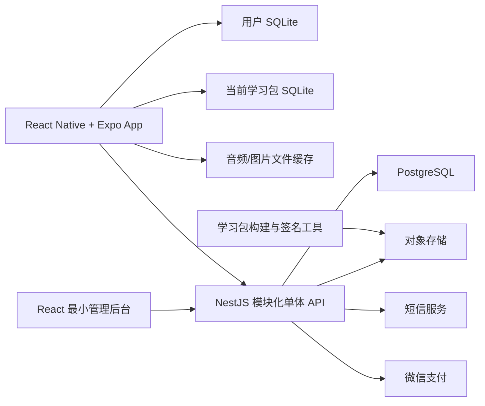

# 本地学习应用 MVP 架构设计

日期：2026-07-26  
状态：已确认  
产品名：记得  
项目根目录：`remember-app`  
目标：约 14 天完成可测试的邀请制真实付费 MVP；以阶段验收为准，外部资质与审核耗时另计。

## 1. 背景与约束

本方案根据原始文档《Get笔记技术核心》及后续需求对齐形成。产品第一阶段面向小学三至六年级，首批内容为英语词汇和英语短句，但内容类型和展示细节属于可变层，不应反向绑死核心架构。

确定约束如下：

- 只有一名开发者，主要由 AI 编写代码，开发者本人和独立上下文 AI 负责审核与测试。
- Android 首发，技术上保留后续 iOS 扩展能力。
- 采用邀请制真实付费 MVP，而非纯演示版本。
- 学习过程本地优先、断网可用。
- 服务端负责账号、支付、权益和学习进度恢复副本。
- 一个监护人账号对应一个学习空间；不建立儿童账号或儿童档案。
- 第一阶段不实现分销，仅避免用不可扩展的硬编码彻底封死来源字段。
- 采用 Monorepo，但各应用独立构建和部署。
- 架构必须简单、稳定，并允许后续按真实压力扩展。

## 2. MVP 范围

MVP只包含七项核心能力：

1. 安装学习包并直接进入学习。
2. 本地卡片学习、SM-2 调度和点词查询。
3. 搜索忘记的内容并重新加入复习。
4. 监护人手机号登录。
5. 微信购买学习包并校验权益。
6. 学习进度云备份和换机恢复。
7. 最小后台管理学习包、订单、权益和退款。

第一阶段明确不实现：

- 微服务、Kubernetes、Redis和消息队列。
- 多设备学习状态合并。
- 分销、佣金和结算系统。
- AI内容生产后台和用户自制学习包。
- 多学习者家庭账号。
- iOS正式发布。
- 订阅、会员、优惠券、排行榜和推荐系统。
- 内容数据库加密和重型 DRM。
- 全局学习内容搜索。
- 动态插件或完整服务端驱动 UI。
- 大数据埋点和自建监控平台。

### 2.1 已确认业务边界

- 一个监护人账号对应一个学习者，不做家庭多成员切换。
- 学习包采用一次性购买；同一学习包的内容纠错和兼容更新免费。教材或内容体系发生实质变化时，可作为新的学习包商品发布。
- 首期只接入微信支付。
- 退款由客服在最小管理后台人工发起。
- 手机号换绑第一阶段不支持；旧手机号不可用时不承诺将原账号数据迁移到新账号。
- 账号注销第一阶段由客服受理并执行，不省略注销能力。
- 首期通过网站或二维码分发Android APK。
- Android最低支持版本为Android 8，手机竖屏为主要适配形态。
- 不设置每日提醒。
- 所有已安装学习包页面只搜索学习包名称；进入单个包后只搜索当前包的主学习内容。
- 卸载学习包保留学习进度；重新安装后通过稳定知识ID恢复。
- 同一时间只执行一个完整学习包下载任务。
- 主卡片音频和图片随包下载；点词弹窗音频首次点击时下载并缓存。

## 3. 总体架构



服务端是一个模块化单体，内部划分为鉴权、学习包目录、订单支付、权益、进度同步和后台管理模块。模块之间通过明确接口调用，但部署为一个 API 程序。只有出现真实容量或组织边界需求时才拆分服务。

## 4. 推荐技术栈与仓库结构

```text
remember-app/
├─ apps/
│  ├─ mobile/          # React Native + Expo + TypeScript
│  ├─ api/             # NestJS + Prisma
│  └─ admin/           # React + Vite + React-admin开源核心
├─ tools/
│  └─ pack-builder/    # 学习包校验、构建、签名
├─ packages/
│  ├─ contracts/       # API DTO、学习包协议及校验器
│  ├─ domain/          # SM-2、任务队列、权益等纯逻辑
│  └─ config/          # TypeScript和Lint共享配置
├─ infra/
│  ├─ compose.yaml     # Caddy、API和PostgreSQL
│  ├─ Caddyfile
│  └─ scripts/         # 备份、恢复验证和部署脚本
├─ docs/
│  ├─ architecture/
│  └─ decisions/
└─ package.json
```

技术选择：

- 包管理与工作区：pnpm workspace。
- 移动端：React Native、Expo 预构建模式、TypeScript、expo-sqlite。
- 服务端：NestJS 模块化单体。
- 数据库：PostgreSQL。
- ORM与迁移：Prisma；复杂查询允许使用受控原生 SQL。
- 管理后台：React + Vite + React-admin开源核心；只复用列表、筛选、表单、详情、data provider和auth provider能力。
- 部署：Docker Compose。
- HTTPS及反向代理：Caddy官方镜像。
- 文件存储：腾讯云COS，通过项目内`PackStorage`边界调用官方Node.js SDK。
- 短信：腾讯云短信SDK 3.0，通过项目内`SmsSender`边界调用。
- 学习包验签：条件采用`@noble/ed25519`；必须先通过Android release实机验证。
- 微信支付：移动端使用微信OpenSDK；NestJS后端使用项目内窄APIv3适配器，不采用社区Node支付SDK。

微信支付依赖原生 Android SDK，因此移动端使用 Expo 开发构建和预构建模式，不以 Expo Go 作为正式运行环境。

Monorepo只共享契约和纯领域逻辑，不允许移动端引用服务端数据库实现，也不允许管理后台绕过 API 直连 PostgreSQL。

### 4.1 成熟项目采用边界

| 能力 | 正式决定 | 不采用的内容 |
|---|---|---|
| Expo与Monorepo | 从Expo官方模板起步，遵循官方pnpm workspace和Metro配置 | 不套用绑定Next.js、tRPC、Supabase或Better Auth的全栈模板 |
| NestJS与Prisma | 采用官方连接、迁移和测试结构 | 不让Controller直接调用Prisma或直接返回Prisma模型 |
| 管理后台 | 采用React-admin开源核心，使用很薄的原生`fetch` data provider | 不使用企业版能力，不建设通用低代码平台 |
| 本地数据 | 直接使用`expo-sqlite`和项目小型数据访问层 | 不引入WatermelonDB、RxDB或PowerSync |
| 复习算法 | 项目内SM-2纯函数，保留`ReviewScheduler`边界 | MVP不改用FSRS，不引入低维护SM-2包 |
| 微信支付 | 官方OpenSDK + 项目窄APIv3适配器 | 不采用缺少充分测试与官方背书的社区Node SDK |
| 部署 | 腾讯云轻量服务器、Docker Compose、Caddy、PostgreSQL、COS | Railway和Render只可作为临时测试候选，不作为大陆生产主环境 |

完整候选、维护情况、许可证、风险和官方来源记录在`docs/research/2026-07-26-mature-architecture-audit.md`。正式实现以本文档的最终决定为准。

## 5. 数据归属

| 数据 | 权威来源 | 其他副本 |
|---|---|---|
| 账号、会话 | 服务端 PostgreSQL | 手机仅缓存展示信息 |
| 订单、支付、退款、权益 | 服务端 PostgreSQL | App只读取结果 |
| 最新学习状态 | 当前主手机 SQLite | 服务端保存恢复副本 |
| 学习包内容 | 已发布并签名的学习包 | 手机保存已安装副本 |
| 音频与图片 | 对象存储或学习包文件 | 手机下载或缓存 |
| 界面偏好 | 手机本地 | 不云同步 |

学习进度采用最终一致性。手机仍存在时，它是最新进度来源；服务器恢复后继续上传。若手机丢失且云端最后一次同步也较旧，只能恢复到云端最后成功接收的状态，不承诺学习进度绝对零丢失。

订单和购买权益必须可追溯、可对账、可从支付记录和备份中完整重建。

## 6. 手机数据库

### 6.1 用户数据库：5张表

位置：App私有目录中的 `user.sqlite`。

| 表 | 用途 |
|---|---|
| `installed_packs` | 已安装学习包名称、版本、文件路径、安装状态和最近打开信息 |
| `learning_states` | 按账号与稳定知识ID保存掌握度、下次复习时间和调度状态 |
| `study_sessions` | 保存当前未完成任务及所属学习包 |
| `study_queue_items` | 保存当前任务卡片顺序、类型和完成状态 |
| `sync_outbox` | 保存尚未获得服务端确认的学习状态变化 |

App设置使用本地键值存储；会话令牌放入 Android Keystore，不为二者增加 SQLite 表。

### 6.2 学习包数据库：固定3张表

每个学习包是一个独立、只读、结构相同的 SQLite 文件，而不是在同一个数据库里为每个包动态创建一张表。

| 表 | 用途 |
|---|---|
| `cards` | 单词、短句等主学习内容、稳定知识ID、排序与受控展示数据 |
| `lexicon_entries` | 点词弹窗所需的词义、词性、释义及懒加载音频引用 |
| `lexicon_forms` | 单词表面形式到词典原形的离线映射，如 `went` 到 `go` |

学习包外部包含签名清单，记录包ID、版本、协议版本、文件哈希和资源清单。卡片可变内容采用按卡片类型校验的受控数据结构；App只渲染白名单内置模块，学习包不得携带可执行代码。

这种结构支持：

- 下载一个文件完成安装。
- 删除包时直接删除对应文件，同时保留 `learning_states`。
- 更新包时先校验新文件，再整体切换。
- 当前包搜索只查询当前文件。
- 所有已安装包搜索只查询 `installed_packs` 的包名。
- 学习时只打开当前包，不同时挂载全部学习包。

## 7. 服务端 PostgreSQL

服务端共13张业务表：

| 表 | 用途与关键约束 |
|---|---|
| `users` | 监护人账号、手机号索引信息、当前主设备和注销状态 |
| `sms_challenges` | 验证码摘要、有效期、尝试次数和发送频率 |
| `sessions` | 不透明会话令牌摘要、设备、有效期和撤销时间 |
| `packs` | 可售学习包目录信息和当前发布版本 |
| `pack_versions` | 不可变版本、对象地址、哈希、签名和发布状态 |
| `orders` | 用户、学习包、金额快照、状态及支付流水标识 |
| `payment_events` | 支付回调摘要和处理结果；支付事件标识唯一 |
| `pack_access` | 用户对学习包的使用权；用户与学习包组合唯一 |
| `refunds` | 人工退款申请、第三方退款单号和结果 |
| `learning_states` | 每个稳定知识ID的最新云端恢复状态和客户端版本 |
| `admin_users` | 独立后台账号、密码摘要、TOTP及状态 |
| `admin_sessions` | 后台不透明会话及有效期 |
| `audit_logs` | 退款、补发、发布和权限操作的不可变审计记录 |

管理后台不建立独立数据库，只能通过 API 访问业务能力。对象存储保存学习包、媒体、APK和加密备份，不属于关系表。

## 8. 核心业务流程

### 8.1 学习与任务继承

```text
打开学习包
→ 恢复未完成任务
→ 加载当前到期内容
→ 补充当次的新内容额度
→ 用户作答
→ 更新本地调度状态
→ 同事务写入待同步队列
→ 继续下一张
```

当天未学习时不累计每日新任务。下次打开时先继续上次未完成任务，再处理当前到期内容，最后补充当次的新内容额度。

### 8.2 找回遗忘内容

用户在当前包中搜索主学习内容，找到后直接重新加入复习。第一阶段不增加章节、收藏夹或复杂分类。

### 8.3 点词查询

例句中的任意英文单词经本地分词和标准化后，通过 `lexicon_forms` 找到原形，再从 `lexicon_entries` 读取解析。弹窗释义离线可用；弹窗单词语音首次点击时下载并缓存。主内容所需音频和图片随学习包下载。

### 8.4 增量同步

每次学习操作在同一个 SQLite 事务中更新学习状态并写入 `sync_outbox`。联网后按批次上传，每项带稳定知识ID、唯一操作标识和递增客户端版本。服务端只接受当前主设备，只在传入版本更新时覆盖现有状态。确认成功后手机删除对应待同步记录。

服务端保存当前状态，不永久保存完整学习事件流水。换机时直接下载服务端当前状态，不执行多设备冲突合并。

### 8.5 支付与权益

```text
App请求服务端创建订单
→ 服务端确定真实价格并返回支付参数
→ App调用微信官方SDK
→ 微信回调服务端
→ 服务端验签
→ 同一事务更新订单并写入权益
→ App查询订单与权益结果
→ 获取下载授权和离线许可
```

App从微信返回时只能显示待确认状态，不能凭客户端结果解锁学习包。支付回调可重复到达，但支付流水唯一、订单状态单向推进、权益组合唯一，因此业务效果只发生一次。

微信支付接入固定采用以下边界：

- App只负责通过微信OpenSDK拉起支付，并在返回后查询服务端订单状态。
- NestJS内的`WechatPayClient`只实现APP下单、查单、退款、退款查询、请求签名、响应验签和回调验签解密。
- 回调必须读取原始请求体，使用微信时间戳、随机串和签名头验签，之后才解密业务数据。
- 微信通知ID、微信交易号和商户订单号使用唯一约束；订单状态变化、支付事件与`pack_access`写入处于同一数据库事务。
- 官方Postman脚本和官方接口样例作为密码学测试向量；支付适配器必须接受独立上下文安全审查。
- 不为支付单独部署Java或Go服务，也不为MVP引入消息队列。

## 9. 必须处理的并发

MVP不建设分布式并发基础设施，只在以下位置使用正确的事务和约束：

1. 支付回调、App查询和后台操作同时访问订单：使用事务、唯一支付流水和订单状态机。
2. 支付回调与后台补发同时发放权益：使用用户与学习包组合唯一约束。
3. 学习同步重复或乱序：使用客户端递增版本执行条件更新。
4. 两台手机同时申请成为主设备：锁定用户记录，在同一事务中切换设备并撤销旧会话。
5. 学习包读取与更新重叠：临时文件下载、完整校验、关闭旧句柄后原子切换。
6. 本地作答时App被杀：学习状态和待同步记录使用同一个SQLite事务。
7. 退款与迟到支付回调同时发生：锁定订单并按合法状态转换执行。

SM-2计算、卡片渲染、当前包搜索、点词查询和任务生成均在本地串行完成，不需要并发架构。

## 10. 鉴权、安全与隐私边界

- 使用监护人手机号短信登录。
- 服务端生成单个高熵不透明会话令牌，只保存令牌摘要。
- App将令牌放在 Android Keystore。
- 一个账号只有一个有效主设备；新设备上线后撤销旧设备会话。
- 每个需要鉴权的API请求都检查服务端会话；会话连续90天不活跃后失效。
- 服务端签发30天离线权益许可，App可在服务器短时故障时继续学习；联网成功后刷新。
- 学习包进行签名、哈希和协议校验，但MVP不做数据库加密或重型 DRM。
- 学习包签名私钥不进入Git、不放入App，也不交给运行期API；App只内置验签公钥。
- 本地、测试和正式环境使用完全不同的短信、支付、数据库和存储凭证。
- 不建立儿童账号或儿童档案，不保存儿童姓名、生日、学校、班级等信息。
- 不接入广告SDK，不建立广告画像。
- 只保留少量第一方技术与产品统计，不上传学习正文、搜索词或具体掌握情况。

## 11. 学习包更新

首期采用完整包更新：

1. App手动检查或获取版本清单。
2. 下载到临时路径。
3. 检查权益和离线许可。
4. 校验清单、哈希、签名和协议版本。
5. 尝试以只读方式打开数据库并执行结构自检。
6. 关闭旧包句柄并原子替换。
7. 更新 `installed_packs`。
8. 失败时保留旧版本并清理临时文件。

学习状态使用稳定 `knowledge_id`，不依赖学习包内部行号，因此更新或卸载学习包不会删除用户进度。

## 12. 可靠性与恢复

- 已登录用户在服务器故障时可凭有效离线许可继续学习。
- 登录、购买和换机恢复可以暂时不可用。
- 目标人工恢复时间为4至8小时。
- 学习进度允许极端情况下少量丢失，但手机仍在时可在恢复后继续上传最新状态。
- 订单、支付、退款和权益必须可追溯并可完整重建。
- PostgreSQL每天生成加密异地备份；上线前及重要迁移后执行恢复演练。
- 学习包与媒体可从对象存储重新下载，不作为用户核心备份。

MVP生产备份使用`pg_dump -Fc`生成一致的自定义格式备份，加密并校验后上传至COS私有桶。每月至少从空数据库完成一次真实恢复演练。随着订单量或恢复点要求提升，再评估腾讯云托管PostgreSQL或WAL/PITR；第一阶段不提前建设。

## 13. 环境、发布与兼容

采用三套环境：本地开发、测试、正式。测试环境初期可与正式环境共用云服务器，但数据库、容器、域名、对象存储前缀和密钥必须隔离。

- CI构建版本化Docker镜像和APK。
- 测试环境允许自动部署。
- 正式环境必须由开发者手动批准。
- 同一个已验证镜像从测试环境提升到正式环境。
- 保留上一个可运行镜像用于程序回退。
- API使用版本前缀，例如 `/api/v1`。
- 服务端至少兼容当前正式App和上一个正式App。
- 学习包清单声明协议版本。
- 普通更新只提醒；安全或协议完全不兼容时才强制更新。
- 接口字段优先新增；删除字段至少跨过一个发布周期。
- 数据库采用先扩展、后切换、再清理的迁移方式。

正式环境采用以下单机拓扑：

```text
公网80/443
    ↓
Caddy官方容器
    ├── NestJS API容器
    ├── React-admin静态文件
    └── PostgreSQL容器（仅内部网络）

知识库、音频、图片、APK和数据库异地备份 → 腾讯云COS
```

服务器使用腾讯云轻量应用服务器和Ubuntu LTS，Docker Compose只编排`caddy`、`api`和`postgres`。PostgreSQL不开放公网端口；Caddy证书数据和PostgreSQL数据使用独立持久卷。中国大陆域名正式提供服务前预留ICP备案时间，不依赖宝塔面板。

## 14. 最小可观测性

- API输出结构化日志，每次请求携带追踪编号。
- 监控服务器存活、磁盘、数据库连接、接口错误和备份结果。
- App收集崩溃与关键同步失败，不记录手机号、令牌、支付密钥和学习正文。
- 支付回调、权益发放和备份失败必须告警。
- 普通技术日志默认保留30天。
- 订单、权益和后台审计作为业务记录长期保存。
- 使用成熟托管错误收集或云厂商基础告警，不自建监控平台。

## 15. 测试与AI代码质量门禁

测试重点：

- 学习调度、任务继承和找回后重新加入复习。
- 学习包协议、签名、损坏文件和更新兼容。
- 同步断网、重复、乱序和App被杀。
- 验证码频控、会话失效、设备切换和离线许可。
- 支付重复回调、延迟回调、金额不符、退款、补发和事务回滚。
- 服务端集成测试使用真实PostgreSQL测试实例。
- UI自动覆盖登录、购买、下载、学习和恢复等主流程；细节样式在真实Android设备验收。

最小代码门禁：

- AI一次只实现一个边界明确的任务。
- 不直接修改主分支，使用功能分支合并。
- 合并前执行类型检查、单元测试、契约测试和构建。
- 鉴权、支付、权益、同步和迁移由独立上下文AI复审。
- 测试环境验证后，由开发者批准正式部署。
- AI不得自动执行正式环境不可逆数据库操作。

AI编码规范已经落盘在`docs/ai-rules/`，Codex通过`$build-learning-app` Skill加载。后续任何实现与本架构冲突时，应显式提出架构变更，而不是在代码中静默绕过。

## 16. 关键技术难点

必须克服的六项问题：

1. 稳定知识ID：同一知识内容跨包共享状态，学习包更新后仍能继承进度。
2. 可中断任务：App退出、被杀、重启或跨天后继续原任务，且新任务不按缺席天数累计。
3. 原子包更新：下载失败、磁盘不足、文件损坏或验签失败时旧包仍可使用。
4. 可无限重试的同步：重复、乱序、弱网和服务器故障不得覆盖更新状态。
5. 支付只产生一次业务效果：重复或延迟回调不得重复发放权益。
6. AI协作一致性：数据库、API和学习包协议具有唯一规范，禁止不同任务自行发明字段。

## 17. 过渡设计及替换条件

| 过渡设计 | 当前理由 | 何时替换 |
|---|---|---|
| API与PostgreSQL同机 | 成本低、部署简单 | 数据库资源成为瓶颈或需要独立容灾时 |
| 单个API实例 | 峰值约百级并发足够 | 单实例CPU、内存或可用性不满足时 |
| PostgreSQL承担频控 | 不引入Redis | 多API实例或频控写入成为热点时 |
| 进程内定时任务 | 无消息队列 | 任务需可靠分发或开始水平扩容时 |
| 单主设备 | 消除同步冲突 | 用户明确需要多设备同时学习时 |
| 人工退款 | 低交易量 | 客服量或退款量达到人工不可控时 |
| 网站/二维码APK | 快速验证 | 进入应用商店或iOS发布阶段时 |
| 本地发布工具签名 | 私钥边界简单 | 内容团队扩大或需要自动发布审批时 |

第一阶段不为这些替换方案预建业务表或服务，只保留清晰模块边界。

## 18. 实际开发顺序

开发不按日期机械推进，而按可验证的阶段门禁推进：

1. 正式文档、Monorepo和自动质量门禁。
2. Expo多SQLite、包验签、微信OpenSDK、微信APIv3密码学及备份恢复五项高风险验证。
3. 学习包协议、Zod契约和固定测试包。
4. 不登录、不付费也能在本地跑通的完整学习闭环。
5. 手机号登录、会话、主设备、学习进度同步和换机恢复。
6. 知识库目录、订单、微信支付和购买权限闭环。
7. React-admin最小后台与退款、补发、发布审计。
8. 包更新、APK发布、正式部署、恢复演练和候选版本验收。

每个阶段必须产出可运行、可测试、可审查的结果后才能进入下一阶段。完整阶段依赖、验收门禁和暂停点见`docs/superpowers/plans/2026-07-26-remember-app-mvp-development-order.md`。若进度延期，优先取消非核心展示和运营功能，不削减鉴权、支付一致性、购买权限恢复、学习状态持久化、签名校验和备份恢复。

## 19. 后续待定规范

AI编码规范和MVP UI规范已经确认并分别落盘在`docs/ai-rules/`与`docs/superpowers/specs/2026-07-26-learning-app-mvp-ui-design.md`。

下列事项仍不在本架构文档中提前定死：

1. 学习内容协议细节：具体字段、卡片类型数据结构、音频与图片规格。
2. SM-2参数：默认间隔、评分映射和再现位置，作为可测试配置而不是架构常量。
3. AI内容生产协议：在建设内容生产后台前另行讨论。

后续规范若与本架构发生冲突，必须记录一条架构决策并更新本文档，不能只在代码中形成隐含规则。

## 20. 架构原则

本MVP遵循以下一句话原则：

> 学习体验留在手机，钱和权限留在服务器；内容包可以替换，学习状态不能因内容包替换而丢失；用数据库事务解决必要并发，不用基础设施堆复杂度。
